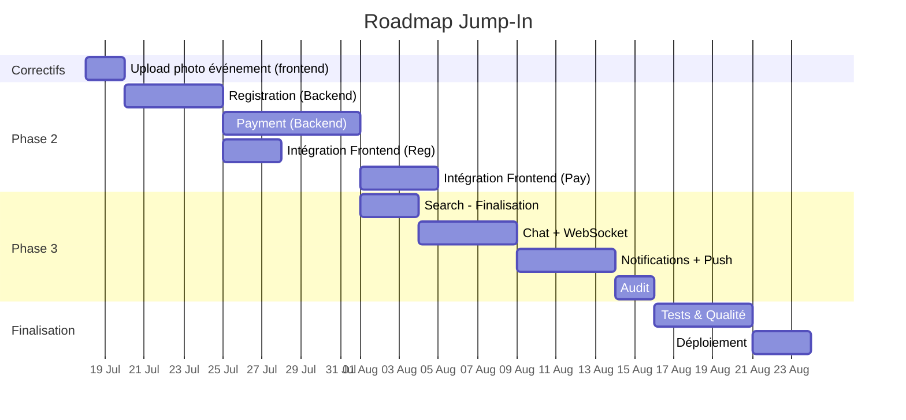

# 🗺️ Plan d'Action — Jump-In

> **Contexte :** Plateforme de mise en relation pour événements sportifs (Sénégal/Dakar).
> **Stack :** Backend NestJS 11 + Prisma 7 + PostgreSQL/PostGIS | Frontend React Native (Expo)
> **Workspaces :** `jump-in` (backend) · `runhub` (frontend)

---

## 📊 État des lieux

| Module Backend | Statut | Frontend Associé (runhub) | Priorité |
|---------------|--------|--------------------------|----------|
| `auth` | ✅ Complété | ✅ Écrans login, onboarding | 🔴 Critique |
| `users` | ✅ Complété | ✅ Écrans profil, édition | 🔴 Critique |
| `sports` | ✅ Complété | ✅ Sports selector, écran sports | 🔴 Critique |
| `clubs` | ✅ Complété | ✅ Écran club detail | 🔴 Critique |
| `events` | ✅ Complété | ⚠️ **Upload cover/gallery non intégré** | 🔴 Critique |
| `common` | ✅ Complété | — | 🔴 Critique |
| `prisma` | ✅ Complété | — | 🔴 Critique |
| `location` | ✅ Complété | ✅ Location picker | 🟠 Haute |
| `upload` | ✅ Complété | ⚠️ **Non branché au frontend** | 🟠 Haute |
| `search` | ⏳ Partiel | ✅ Écran explorer, carte, filtres | 🟠 Haute |
| `registration` | ❌ À faire | ✅ Écrans ticket, check-in, liste | 🔴 Critique |
| `payment` | ❌ À faire | ❌ Non commencé | 🔴 Critique |
| `chat` | ❌ À faire | ✅ Écran chat room | 🟠 Haute |
| `notifications` | ❌ À faire | ✅ Écran notifications | 🟠 Haute |
| `audit` | ❌ À faire | ❌ Non commencé | 🟢 Basse |

---

## 🚨 Correctifs immédiats

### Étape 0 : Upload photo événement (Frontend → Backend)

**Problème :** L'écran de création d'événement (`CreationScreen`) affiche un `ImageUploadPlaceholder` statique sans logique d'upload. Le `useEventCreationStore` ne stocke pas de `coverUrl`, et il n'y a aucune intégration avec l'API d'upload.

**Ce qui doit être fait :**

#### 0.1 Backend — Vérifier que l'endpoint couvre bien les besoins

✅ **Déjà OK :**
- `POST /upload/presigned-url` accepte `type: 'event-cover'`
- `POST /events/:id/gallery` avec `EventOrganizerGuard` pour ajouter des photos
- `CreateEventDto.coverUrl` est déjà présent et optionnel
- `EventsService.create()` intègre déjà `coverUrl`

**À vérifier :**
- [ ] Vérifier que `EventsService.create()` utilise bien `coverUrl` dans la création (relire la suite)
- [ ] Vérifier que `EventsService.update()` fait de même

#### 0.2 Frontend — Intégrer l'upload dans l'écran de création

**Dans `useEventCreationStore` :**
- [ ] Ajouter un champ `coverUrl: string | null` dans le store
- [ ] Ajouter un champ `coverKey: string | null` (pour suivre la clé R2)
- [ ] Mettre à jour `resetStore()` pour réinitialiser ces nouveaux champs

**Dans `CreationScreen` :**
- [ ] Installer `expo-image-picker` si pas déjà fait
- [ ] Ajouter un handler `handlePickImage()` qui :
  1. Ouvre la galerie avec `ImagePicker.launchImageLibraryAsync()`
  2. Récupère l'URI et le MIME type de l'image choisie
  3. Appelle `POST /upload/presigned-url` avec `{ type: 'event-cover', contentType }`
  4. Upload l'image directement vers Cloudflare R2 via l'URL présignée
  5. Met à jour `coverUrl` dans le store avec le `publicUrl` reçu
- [ ] Modifier `<ImageUploadPlaceholder>` pour :
  - Afficher l'image téléchargée en prévisualisation si `coverUrl` est défini
  - Utiliser `onPress` pour déclencher `handlePickImage()`

**Dans `EventPreviewScreen` (/apercu) :**
- [ ] Afficher la `coverUrl` prévisualisée si présente
- [ ] Passer `coverUrl` dans le payload de création d'événement

**API `EventsApi.createEvent()` :**
- [ ] Vérifier que le type `CreateEventPayload` inclut bien `coverUrl`

---

## 🎯 Phases de développement

### Phase 2 — Transactions (Priorité 🔴 Critique)

> Cœur business : inscriptions, paiements. Zéro tolérance aux bugs.

#### Étape 1 : Module `registration`

**Endpoints backend à créer :**

| Méthode | Route | Description |
|---------|-------|-------------|
| `POST` | `/events/:id/register` | S'inscrire à un événement |
| `DELETE` | `/events/:id/register` | Annuler son inscription |
| `GET` | `/events/:id/registrations` | Liste des inscrits *(organisateur)* |
| `GET` | `/users/me/registrations` | Mes inscriptions |
| `GET` | `/registrations/:id/ticket` | QR code / ticket |
| `POST` | `/registrations/check-in` | Scanner QR pour valider l'entrée |
| `POST` | `/registrations/:id/photos` | Ajouter photo post-event |
| `GET` | `/events/:id/photos` | Photos des participants |

**Structure à créer :**
```
src/registration/
├── registration.module.ts
├── registration.controller.ts
├── registration.service.ts
├── dto/
│   ├── register.dto.ts
│   └── check-in.dto.ts
└── registration.service.spec.ts
```

**Règles métier clés :**
- Vérification capacité avec `SELECT ... FOR UPDATE` (pas de sur-réservation)
- Si `price = 0` → status `PAID` directement
- Si payant → status `PENDING`, déclencher paiement
- `ticketCode` généré automatiquement (UUID ou nanoid)
- Unicité : 1 user ≠ 1 event
- Check-in : vérifier status `PAID` → passer en `CHECKED_IN`

**Frontend associé :**
- `runhub/src/app/ticket/[id].tsx` → TicketDetailScreen
- `runhub/src/app/check-in/[id].tsx` → CheckInListScreen + QrScannerScreen
- `runhub/src/features/check-in/` → déjà partiellement présent

**Tâches :**
- [ ] Créer le dossier `src/registration/` avec les fichiers
- [ ] Implémenter `RegistrationService` avec transactions + verrou capacité
- [ ] Implémenter `RegistrationController` (8 endpoints)
- [ ] Créer les DTOs : `RegisterDto`, `CheckInDto`
- [ ] Ajouter `RegistrationModule` dans `app.module.ts`
- [ ] Tester l'intégration avec les screens frontend existants

---

#### Étape 2 : Module `payment`

**Endpoints backend à créer :**

| Méthode | Route | Description |
|---------|-------|-------------|
| `POST` | `/payments/initiate` | Initier un paiement |
| `POST` | `/payments/webhook/:provider` | Callback PSP *(public)* |
| `GET` | `/users/me/payments` | Historique paiements |
| `GET` | `/users/me/payment-methods` | Moyens de paiement |
| `POST` | `/users/me/payment-methods` | Ajouter un moyen |
| `PATCH` | `/users/me/payment-methods/:id/default` | Définir par défaut |
| `DELETE` | `/users/me/payment-methods/:id` | Supprimer |

**Structure à créer :**
```
src/payment/
├── payment.module.ts
├── payment.controller.ts
├── payment.service.ts
├── webhook/
│   ├── webhook.controller.ts
│   └── webhook.service.ts
├── payment-methods/
│   ├── payment-methods.controller.ts
│   └── payment-methods.service.ts
├── providers/
│   ├── wave.provider.ts
│   ├── orange-money.provider.ts
│   ├── free-money.provider.ts
│   └── card.provider.ts
├── dto/
│   ├── initiate-payment.dto.ts
│   └── create-payment-method.dto.ts
└── payment.service.spec.ts
```

**Règles métier clés :**
- Idempotence : `@@unique([provider, providerRef])` — éviter doublons webhook
- Un seul Payment SUCCESS par Registration
- `fee` = commission plateforme calculée côté serveur
- Ne jamais stocker les données de carte en clair
- Webhook : vérifier signature PSP

**Tâches :**
- [ ] Créer le dossier `src/payment/` avec la structure complète
- [ ] Implémenter `PaymentService` (initiation, gestion webhook)
- [ ] Implémenter les providers (Wave, Orange Money, Free Money, Carte)
- [ ] Implémenter `WebhookController` + validation signature
- [ ] Implémenter `PaymentMethodsService`
- [ ] Ajouter `PaymentModule` dans `app.module.ts`

---

### Phase 3 — Engagement (Priorité 🟠 Haute)

> Rendre l'app vivante et addictive.

#### Étape 3 : Module `search` — Finalisation

**Ce qui manque :**
- Feed public : `GET /feed` (events PUBLISHED + PUBLIC triés par date)
- Feed nearby : `GET /feed/nearby` (géolocalisation)
- Feed for-you : `GET /feed/for-you` (personnalisé par sports)
- Recherche events : `GET /search/events`
- Recherche users : `GET /search/users`

**Tâches :**
- [ ] Ajouter `FeedController` (3 endpoints)
- [ ] Finaliser `SearchController` (recherche events + users)
- [ ] Implémenter pagination cursor-based pour le feed
- [ ] Intégrer le mode `ecoData` (images basse résolution)

---

#### Étape 4 : Module `chat` (WebSocket)

**Endpoints REST :**

| Méthode | Route | Description |
|---------|-------|-------------|
| `GET` | `/events/:id/messages` | Historique (cursor-based) |
| `GET` | `/events/:id/messages/pinned` | Messages épinglés |
| `PATCH` | `/messages/:id/pin` | Épingler/désépingler |
| `DELETE` | `/messages/:id` | Supprimer |

**WebSocket Gateway :**

| Événement | Description |
|-----------|-------------|
| `message:send` | Envoyer un message |
| `message:new` | Nouveau message reçu |
| `message:typing` | Indicateur de frappe |
| `message:pinned` | Message épinglé |

**Structure :**
```
src/chat/
├── chat.module.ts
├── chat.controller.ts
├── chat.gateway.ts
├── chat.service.ts
├── dto/
│   └── send-message.dto.ts
└── chat.service.spec.ts
```

**Tâches :**
- [ ] Créer `ChatModule` avec `@nestjs/websockets`
- [ ] Implémenter `ChatGateway` (WebSocket)
- [ ] Implémenter `ChatService` (CRUD messages)
- [ ] Restreindre l'envoi aux inscrits (Registration PAID/CHECKED_IN)
- [ ] Relier au frontend `runhub/src/features/chat/screens/ChatRoomScreen.tsx`

---

#### Étape 5 : Module `notifications`

**Endpoints :**

| Méthode | Route | Description |
|---------|-------|-------------|
| `GET` | `/users/me/notifications` | Notifications paginées |
| `GET` | `/users/me/notifications/unread-count` | Non lues |
| `PATCH` | `/notifications/:id/read` | Marquer comme lue |
| `PATCH` | `/notifications/read-all` | Tout marquer comme lu |
| `POST` | `/users/me/devices` | Enregistrer device push |
| `DELETE` | `/users/me/devices/:id` | Supprimer device |

**Déclencheurs :**

| Type | Déclenché par | Destinataire |
|------|--------------|--------------|
| `JOIN` | Nouvelle inscription | Organisateur |
| `REMINDER` | Cron (1h avant) | Inscrits |
| `MESSAGE` | Nouveau message | Inscrits |
| `PAYMENT` | Paiement confirmé/échoué | Payeur |
| `INVITE` | Invitation club | Invité |

**Tâches :**
- [ ] Créer `NotificationsModule`
- [ ] Implémenter les services CRUD notifications
- [ ] Intégrer Firebase Admin SDK pour FCM
- [ ] Implémenter le push service
- [ ] Créer les déclencheurs dans les autres modules (registration, payment, chat)
- [ ] Relier au frontend `runhub/src/features/notifications/screens/NotificationsScreen.tsx`

---

#### Étape 6 : Module `audit`

> Module passif — écoute les événements NestJS et logue dans `AuditLog`.

**Actions à logger :**

| Action | entityType | Déclencheur |
|--------|-----------|-------------|
| `create` | Event | Création d'un event |
| `update` | Event | Modification |
| `publish` | Event | Publication |
| `cancel` | Event | Annulation |
| `register` | Registration | Inscription |
| `check_in` | Registration | Check-in |
| `payment_success` | Payment | Paiement confirmé |
| `payment_failed` | Payment | Paiement échoué |
| `soft_delete` | User | Suppression de compte |
| `role_change` | ClubMember | Changement de rôle |

**Tâches :**
- [ ] Créer `AuditModule` (passif, pas de controller)
- [ ] Implémenter `AuditListener` avec `@OnEvent()`
- [ ] Intégrer `EventEmitter2` dans les autres modules

---

### 🔧 Améliorations transverses

#### Étape 7 : Finalisation du Search

- [ ] Ajouter `FeedController` (3 endpoints : public, nearby, for-you)
- [ ] Implémenter `GET /search/events`
- [ ] Implémenter `GET /search/users`

#### Étape 8 : Tests & Qualité

- [ ] Tests unitaires pour `RegistrationService`
- [ ] Tests unitaires pour `PaymentService`
- [ ] Tests e2e pour les flux critiques (inscription → paiement → check-in)
- [ ] Ajouter un `PrismaExceptionFilter` pour traduire les erreurs Prisma en HTTP

#### Étape 9 : Déploiement & Monitoring

- [ ] Ajouter un système de logging structuré (utiliser le logger NestJS)
- [ ] Configurer les migrations Prisma pour la prod
- [ ] Documenter les variables d'environnement supplémentaires

---

## 📅 Roadmap recommandée



## 🎯 Priorité immédiate (les 2 prochaines semaines)

| Période | Travail | Durée |
|---------|---------|-------|
| **Maintenant** | 🔧 Upload photo événement (intégration frontend R2) | 2 jours |
| **Semaine 1** | Module `registration` (backend complet) | 5 jours |
| **Semaine 2** | Module `payment` (backend + intégration Wave/OM) | 7 jours |

---

## 📂 Structure des fichiers à respecter

```
src/
├── registration/
│   ├── registration.module.ts
│   ├── registration.controller.ts
│   ├── registration.service.ts
│   ├── dto/
│   │   ├── register.dto.ts
│   │   └── check-in.dto.ts
│   └── ...
├── payment/
│   ├── payment.module.ts
│   ├── payment.controller.ts
│   ├── payment.service.ts
│   ├── webhook/
│   ├── payment-methods/
│   ├── providers/
│   ├── dto/
│   └── ...
├── chat/
│   ├── chat.module.ts
│   ├── chat.gateway.ts
│   ├── chat.controller.ts
│   ├── chat.service.ts
│   └── ...
├── notifications/
│   ├── notifications.module.ts
│   ├── notifications.controller.ts
│   ├── notifications.service.ts
│   ├── push/
│   ├── devices/
│   └── ...
└── audit/
    ├── audit.module.ts
    ├── audit.service.ts
    ├── audit.listener.ts
    └── ...
```

---

> **Prochaine étape suggérée :** 🔧 Corriger l'upload photo événement (étape 0). Ensuite, attaquer le module `registration` — le plus critique après la Phase 1 ! 🚀
