# Jump-In — Documentation Fonctionnelle du Schéma

> **Fichier source** : `prisma/schema.prisma`
> **Base de données** : PostgreSQL + PostGIS
> **17 modèles · 9 enums · 5 tables de jointure**

---

## Table des matières

1. [Configuration & Infrastructure](#1-configuration--infrastructure)
2. [Les Enums — Les règles du jeu](#2-les-enums--les-règles-du-jeu)
3. [User — Le cœur du système](#3-user--le-cœur-du-système)
4. [Sport — Le catalogue sportif](#4-sport--le-catalogue-sportif)
5. [Club — Les communautés](#5-club--les-communautés)
6. [Event — L'événement sportif](#6-event--lévénement-sportif)
7. [Inscription & Paiement — Le parcours transactionnel](#7-inscription--paiement--le-parcours-transactionnel)
8. [Chat — La messagerie en temps réel](#8-chat--la-messagerie-en-temps-réel)
9. [Notifications & Push — Le système d'alertes](#9-notifications--push--le-système-dalertes)
10. [AuditLog — La traçabilité admin](#10-auditlog--la-traçabilité-admin)
11. [Carte des relations complète](#11-carte-des-relations-complète)
12. [Stratégies de suppression](#12-stratégies-de-suppression)
13. [Indexation — Pourquoi chaque index existe](#13-indexation--pourquoi-chaque-index-existe)

---

## 1. Configuration & Infrastructure

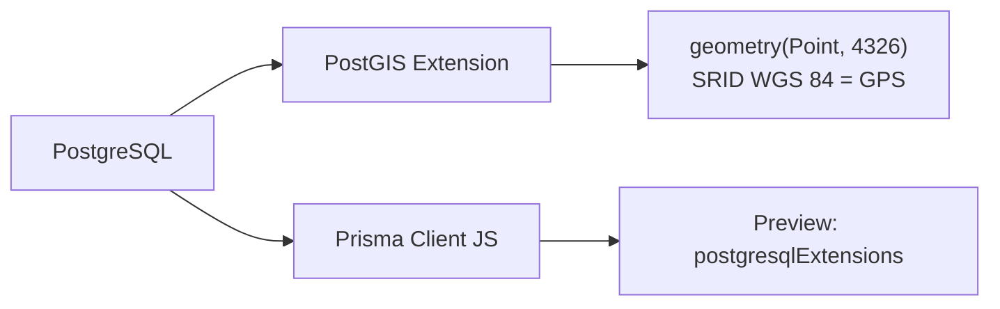

### Datasource

| Paramètre | Valeur | Rôle |
|---|---|---|
| `provider` | `postgresql` | Base relationnelle |
| `extensions` | `[postgis]` | Ajoute les types géospatiaux (points GPS, calcul de distance, recherche "autour de moi") |

### Generator

| Paramètre | Valeur | Rôle |
|---|---|---|
| `provider` | `prisma-client-js` | Génère le client TypeScript/JS typé |
| `previewFeatures` | `postgresqlExtensions` | Active le support des extensions PostgreSQL dans Prisma |

### Conventions globales

- **IDs** : UUID v4 partout (`@db.Uuid`) — pas d'auto-incréments, sûr pour les systèmes distribués
- **Timestamps** : `@db.Timestamptz` — stocke le fuseau horaire (important pour une app mobile multi-fuseaux)
- **Mapping** : camelCase côté code (`createdAt`) → snake_case côté DB (`created_at`) via `@map`
- **Tables** : noms au pluriel via `@@map("users")`, `@@map("events")`, etc.

---

## 2. Les Enums — Les règles du jeu

Chaque enum définit les **états possibles** d'une entité. Ils sont mappés en snake_case dans la base pour la lisibilité SQL.

### EventStatus — Cycle de vie d'un événement

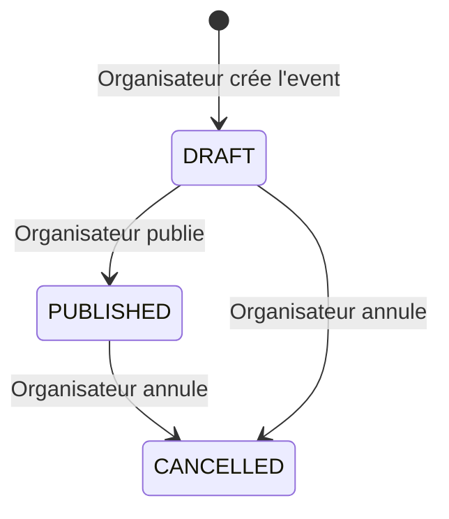

| Valeur | Signification |
|---|---|
| `DRAFT` | Brouillon — visible uniquement par l'organisateur |
| `PUBLISHED` | Publié — visible sur le feed (si visibility = PUBLIC) |
| `CANCELLED` | Annulé — n'apparaît plus dans les résultats, mais reste en base |

### EventVisibility — Qui peut voir l'événement

| Valeur | Signification |
|---|---|
| `PUBLIC` | Visible sur le feed public, trouvable par recherche |
| `UNLISTED` | Accessible uniquement via le lien de partage (`shareSlug`) — pas dans le feed |

> **Combo clé** : Seuls les events `PUBLISHED` + `PUBLIC` apparaissent dans le feed. Un event `PUBLISHED` + `UNLISTED` est un event "privé par lien".

### PaymentProvider — Moyens de paiement

| Valeur | Cible marché |
|---|---|
| `WAVE` | Afrique de l'Ouest (Sénégal, Côte d'Ivoire…) |
| `ORANGE_MONEY` | Afrique francophone |
| `FREE_MONEY` | Sénégal (Free/Tigo) |
| `CARD` | Paiement par carte bancaire (Visa/Mastercard) |

### RegistrationStatus — Parcours d'inscription

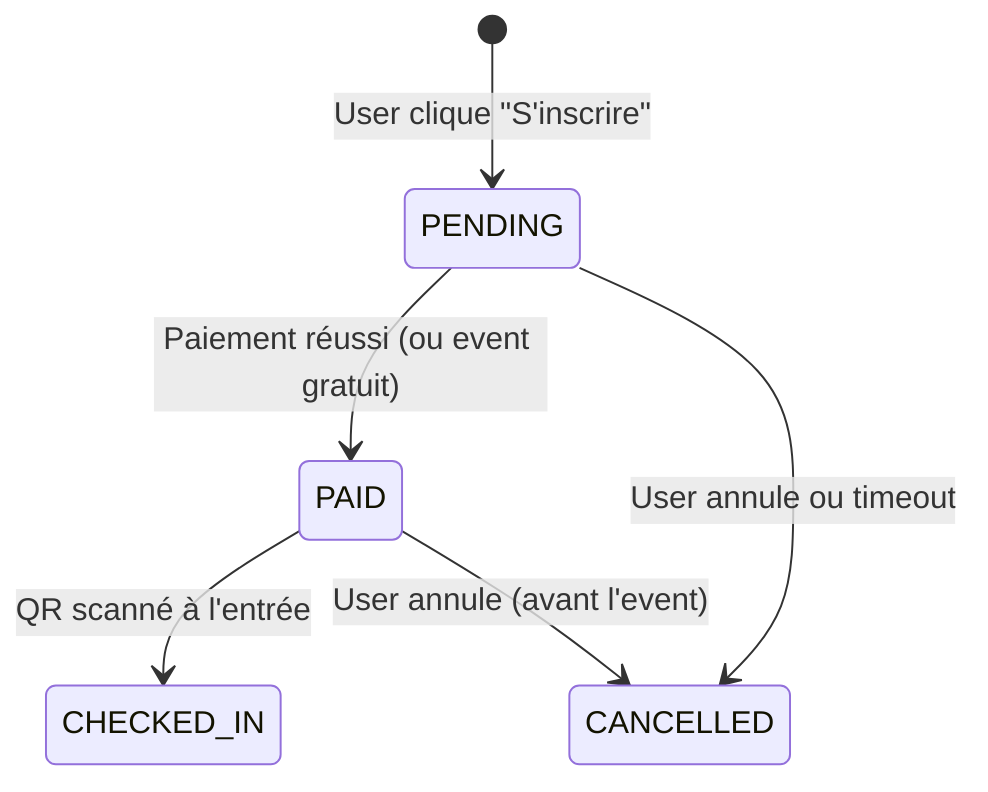

| Valeur | Signification |
|---|---|
| `PENDING` | Inscription créée, en attente de paiement |
| `PAID` | Paiement confirmé — le ticket QR est actif |
| `CHECKED_IN` | L'utilisateur est physiquement présent (QR scanné) |
| `CANCELLED` | Inscription annulée par l'utilisateur ou le système |

### PaymentStatus — États d'une transaction

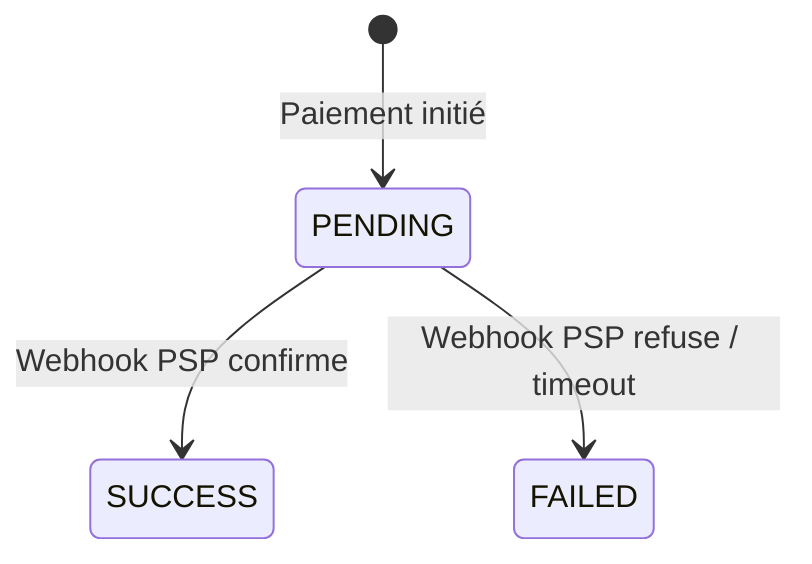

| Valeur | Signification |
|---|---|
| `PENDING` | Paiement en cours — en attente du callback du provider |
| `SUCCESS` | Paiement confirmé par le PSP (provider de services de paiement) |
| `FAILED` | Paiement échoué ou expiré |

### MessageKind — Types de messages dans le chat

| Valeur | Utilisation |
|---|---|
| `TEXT` | Message texte classique |
| `LOCATION` | Partage de position GPS (les coords sont dans `metadata` en JSON) |
| `SYSTEM` | Message système auto-généré ("X a rejoint l'événement", "L'organisateur a épinglé un message") |

### NotificationType — Catégories de notifications push

| Valeur | Déclencheur |
|---|---|
| `REMINDER` | Rappel automatique avant le début d'un événement |
| `JOIN` | Quelqu'un s'est inscrit à ton événement |
| `SPOT` | Place libérée sur un event complet |
| `MESSAGE` | Nouveau message dans le chat d'un event auquel tu participes |
| `PAYMENT` | Confirmation / échec de paiement |
| `INVITE` | Invitation à rejoindre un club ou un événement |

### PlatformType & ClubRole

| Enum | Valeurs | Rôle |
|---|---|---|
| `PlatformType` | `IOS`, `ANDROID` | Distingue les tokens push (APNs vs FCM) |
| `ClubRole` | `MEMBER`, `ADMIN`, `OWNER` | Hiérarchie de permissions dans un club |

---

## 3. User — Le cœur du système

Le `User` est l'entité centrale. Tout le système tourne autour de lui.

### Champs détaillés

| Champ | Type | Obligatoire | Rôle fonctionnel |
|---|---|---|---|
| `id` | UUID | ✅ | Identifiant unique, généré automatiquement |
| `phone` | String | ✅ unique | Numéro de téléphone — sert d'identifiant de connexion (OTP SMS) |
| `username` | String | ✅ unique | Pseudo public visible par tous les utilisateurs |
| `fullName` | String? | ❌ | Nom complet (optionnel, pour le profil) |
| `avatarUrl` | String? | ❌ | URL de la photo de profil (stockée sur un CDN/S3) |
| `bio` | String? | ❌ | Courte description du profil |
| `city` | String? | ❌ | Ville déclarée par l'utilisateur |
| `coords` | geometry | ❌ | Position GPS exacte — pour la fonctionnalité "autour de moi" |
| `ecoData` | Boolean | ✅ (défaut: false) | **Mode éco-data** : si activé, l'app envoie des images en basse résolution pour économiser la data mobile |
| `notifEnabled` | Boolean | ✅ (défaut: true) | Active/désactive les notifications push globalement |
| `deletedAt` | DateTime? | ❌ | **Soft-delete** : quand non-null, le compte est "supprimé" mais les données restent |
| `createdAt` | DateTime | ✅ | Date de création du compte |
| `updatedAt` | DateTime | ✅ | Dernière modification du profil |

### Fonctionnalités clés

**🔑 Authentification par téléphone**
- Pas d'email/mot de passe. L'utilisateur se connecte avec son numéro de téléphone + code OTP par SMS.
- `phone` est unique → un seul compte par numéro.

**📍 Géolocalisation**
- `coords` stocke la position GPS (PostGIS Point, SRID 4326 = standard GPS mondial).
- Permet les requêtes "événements à moins de 5km" via `ST_DWithin` en SQL brut.
- Indexé avec un index GiST pour des performances optimales sur les requêtes spatiales.

**♻️ Soft-delete**
- On ne supprime **jamais** physiquement un user. On met `deletedAt = now()`.
- **Pourquoi ?** Un user supprimé a peut-être organisé des events, envoyé des messages, effectué des paiements. Supprimer la ligne casserait toutes ces références.
- Toutes les requêtes applicatives ajoutent `WHERE deleted_at IS NULL`.

### Toutes les relations du User

```mermaid
graph TD
    U[User] --> OE["organizedEvents<br/>Events qu'il a créés"]
    U --> S["sports<br/>Sports qu'il pratique"]
    U --> PM["paymentMethods<br/>Ses moyens de paiement"]
    U --> R["registrations<br/>Ses inscriptions"]
    U --> CI["checkedInRegistrations<br/>Inscriptions qu'il a validées (scan QR)"]
    U --> P["payments<br/>Ses paiements"]
    U --> FC["followedClubs<br/>Clubs qu'il suit"]
    U --> F["favorites<br/>Events favoris"]
    U --> M["messages<br/>Messages envoyés"]
    U --> L["likes<br/>Events likés"]
    U --> RN["receivedNotifications<br/>Notifs reçues"]
    U --> TN["triggeredNotifications<br/>Notifs qu'il a déclenchées"]
    U --> D["devices<br/>Appareils mobiles"]
    U --> CM["clubMemberships<br/>Clubs dont il est membre"]
    U --> OC["ownedClubs<br/>Clubs qu'il a créés"]
```

---

## 4. Sport — Le catalogue sportif

Table de référence pour les disciplines sportives. Gérée par l'admin, pas par les utilisateurs.

| Champ | Rôle |
|---|---|
| `slug` | Identifiant URL-friendly unique (`football`, `basketball`, `running`…) |
| `labelFr` | Nom affiché en français (`"Football"`, `"Course à pied"`) |
| `color` | Code couleur pour l'UI (badge, tag, icône) — ex: `"#FF5722"` |

### Relations M:N avec UserSport et ClubSport

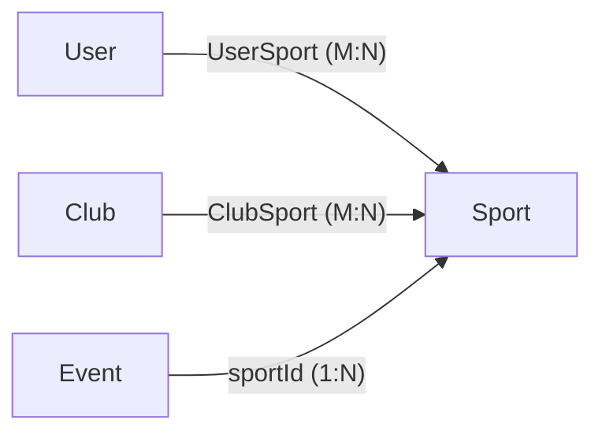

- Un **user** peut pratiquer plusieurs sports → filtre du feed personnalisé
- Un **club** peut couvrir plusieurs sports → club multisport
- Un **event** a un seul sport → catégorisation précise

> **Clé composite** : `@@id([userId, sportId])` — pas de doublon possible. Un user ne peut pas ajouter "Football" deux fois.

---

## 5. Club — Les communautés

Un club est une organisation/communauté qui peut publier des événements.

### Champs détaillés

| Champ | Rôle |
|---|---|
| `name` | Nom du club affiché |
| `handle` | Identifiant unique type "@handle" — comme un username pour le club |
| `ownerId` | Le créateur du club (FK vers User) — **seule source de vérité** pour le ownership |
| `bio` | Description du club |
| `logoUrl` | Logo du club |
| `coverUrl` | Image de couverture |
| `baseName` | Nom du lieu/base d'entraînement du club |
| `coords` | Position GPS du club (pour la recherche géographique) |
| `verified` | Badge vérifié (défaut: false) — activé manuellement par l'admin plateforme |

### Système de membres — ClubMember

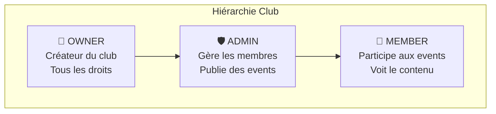

- **OWNER** : Celui qui a **créé** le club. Un seul par club (garanti par un index unique partiel en SQL). C'est `Club.ownerId` qui fait autorité — c'est **la seule source de vérité**. Le owner est aussi inscrit dans `ClubMember` avec `role = OWNER` pour qu'il apparaisse dans la liste des membres, mais c'est une conséquence, pas la référence.
- **ADMIN** : Ajouté par le owner. Peut gérer les membres et publier des événements au nom du club.
- **MEMBER** : Membre simple, peut voir le contenu du club.

### Système de follow — ClubFollow

Suivre un club ≠ être membre. Un **follower** reçoit les notifications de nouveaux events du club dans son feed, sans être membre du club.

---

## 6. Event — L'événement sportif

C'est le **modèle central** de Jump-In. Tout le reste gravite autour.

### Champs détaillés

| Champ | Rôle |
|---|---|
| `organizerId` | L'utilisateur qui a créé l'event (obligatoire) |
| `clubId` | Le club organisateur (optionnel — un event peut être individuel) |
| `sportId` | La discipline sportive (obligatoire) |
| `title` | Titre de l'événement |
| `description` | Description détaillée |
| `coverUrl` | Image de couverture |
| `startsAt` | Date/heure de début (avec fuseau horaire) |
| `endsAt` | Date/heure de fin (optionnel — pour les events "open-ended") |
| `venueName` | Nom du lieu ("Stade Léopold Sédar Senghor") |
| `coords` | Position GPS du lieu (recherche géographique) |
| `capacity` | Nombre max de participants (null = illimité) |
| `price` | Prix en unités de la monnaie. 0 = gratuit |
| `currency` | Code devise ISO (défaut "XOF" = Franc CFA) |
| `status` | Cycle de vie : DRAFT → PUBLISHED → CANCELLED |
| `visibility` | PUBLIC ou UNLISTED |
| `shareSlug` | Slug unique pour le lien de partage (`jump-in.app/e/match-foot-dakar-23`) |

### Flux de création d'un événement

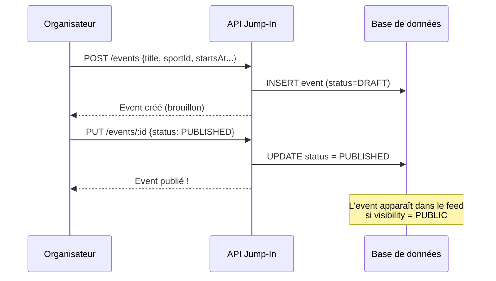

### Galerie photos — EventGallery

Photos ajoutées par l'organisateur pour présenter l'événement.

| Champ | Rôle |
|---|---|
| `url` | URL de l'image (CDN) |
| `position` | Ordre d'affichage dans le carrousel (0, 1, 2…) |

### Photos participants — EventPhoto

Photos ajoutées par les **participants inscrits** après l'événement. Liées à la `Registration` (pas directement à l'Event) → seuls ceux qui ont participé peuvent poster.

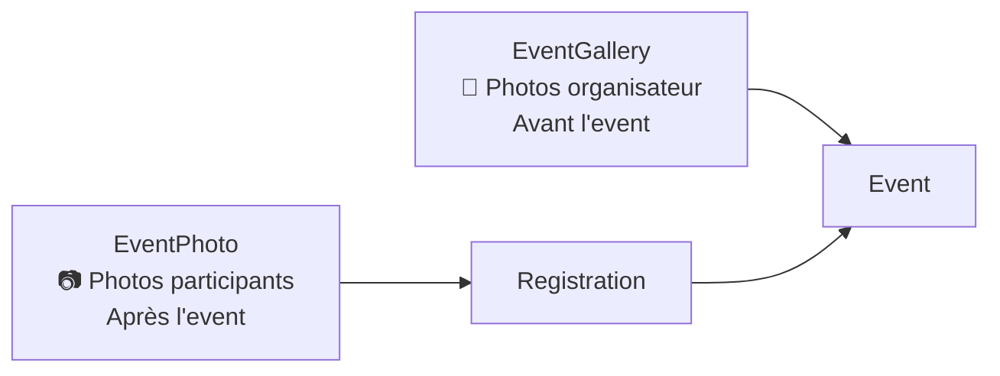

### Interactions sociales — Favorite & Like

Deux actions distinctes sur un événement :

| Action | Modèle | Sémantique | Usage UI |
|---|---|---|---|
| **Favori** ⭐ | `Favorite` | "Je veux le retrouver plus tard" | Liste "Mes favoris" dans le profil |
| **Like** ❤️ | `Like` | "J'aime cet event" | Compteur de likes sur la carte event |

> Les deux sont des tables de jointure M:N avec clé composite `@@id([userId, eventId])` → un user ne peut liker/favoriser qu'une seule fois.

---

## 7. Inscription & Paiement — Le parcours transactionnel

C'est le flux le plus critique de l'app. Il implique de l'argent réel.

### Registration — L'inscription

| Champ | Rôle |
|---|---|
| `eventId` + `userId` | Clé unique composite → un user ne peut s'inscrire qu'une fois à un event |
| `ticketCode` | Code unique encodé dans le QR code du ticket — scanné à l'entrée |
| `status` | PENDING → PAID → CHECKED_IN (ou CANCELLED) |
| `checkedInAt` | Timestamp du scan QR |
| `checkedInById` | Qui a scanné le QR (l'organisateur ou un admin) |

### Flux d'inscription complet

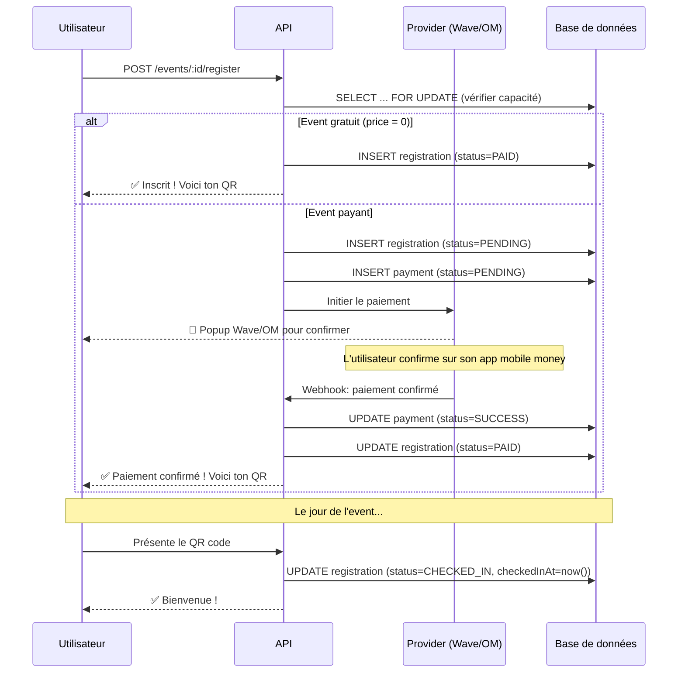

### Gestion de la capacité

> La vérification de capacité utilise `SELECT ... FOR UPDATE` dans une transaction SQL pour éviter la **sur-réservation** (race condition si 2 users s'inscrivent en même temps sur la dernière place).

### Payment — La transaction financière

| Champ | Rôle |
|---|---|
| `registrationId` | Lien vers l'inscription |
| `userId` | Qui paie (redondant avec registration.userId, mais permet des requêtes directes) |
| `paymentMethodId` | Le moyen de paiement utilisé (Wave, OM…) |
| `provider` | Le PSP utilisé pour cette transaction |
| `amount` | Montant payé (dans la devise indiquée) |
| `fee` | Commission plateforme prélevée |
| `currency` | Code devise (défaut XOF) |
| `status` | PENDING → SUCCESS ou FAILED |
| `providerRef` | Référence unique du PSP (pour la réconciliation) |

**Pourquoi 1:N entre Registration et Payment ?**
Un paiement peut échouer. L'utilisateur ré-essaie → nouveau Payment créé. Seul **un** Payment peut être en `SUCCESS` (garanti par un index unique SQL côté migration).

**Idempotence des webhooks** : `@@unique([provider, providerRef])` empêche qu'un même webhook PSP crée deux paiements. Si Wave envoie 2 fois le même callback, le deuxième INSERT échoue.

### PaymentMethod — Moyens de paiement enregistrés

Un user peut enregistrer plusieurs moyens de paiement (ex: un compte Wave + une carte).

| Champ | Rôle |
|---|---|
| `provider` | Type de provider (WAVE, ORANGE_MONEY…) |
| `accountRef` | Référence du compte chez le provider (numéro de téléphone Wave, etc.) |
| `isDefault` | Méthode par défaut — une seule par user (garanti par index unique partiel SQL) |

---

## 8. Chat — La messagerie en temps réel

Chaque événement a son propre fil de discussion (group chat).

| Champ | Rôle |
|---|---|
| `eventId` | Le chat est lié à un événement |
| `senderId` | Qui a envoyé le message |
| `body` | Contenu textuel du message |
| `metadata` | Données JSON optionnelles (coordonnées GPS pour les messages LOCATION, données enrichies…) |
| `kind` | TEXT, LOCATION, ou SYSTEM |
| `pinned` | L'organisateur peut épingler des messages importants |
| `updatedAt` | Permet de tracker si un message a été édité |

### Fonctionnalités chat

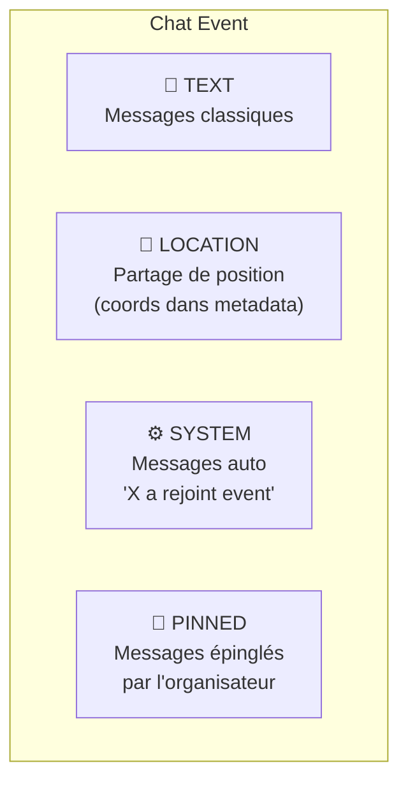

### Index stratégiques du chat

| Index | Usage |
|---|---|
| `[eventId, createdAt]` | Pagination chronologique du chat (charger les 50 derniers messages) |
| `[senderId]` | Trouver tous les messages d'un utilisateur (modération) |
| `[eventId, pinned]` | Charger rapidement les messages épinglés d'un event |

---

## 9. Notifications & Push — Le système d'alertes

### Notification

Notification in-app persistée en base.

| Champ | Rôle |
|---|---|
| `userId` | Le destinataire de la notification |
| `type` | Catégorie (REMINDER, JOIN, SPOT, MESSAGE, PAYMENT, INVITE) |
| `actorId` | L'utilisateur qui a déclenché la notif (ex: "**Mohamed** s'est inscrit à ton event") |
| `eventId` | L'événement concerné (optionnel — ex: PAYMENT n'a pas forcément d'event) |
| `body` | Texte de la notification |
| `readAt` | null = non lue. Timestamp = lue à cette date |

### Flux type d'une notification

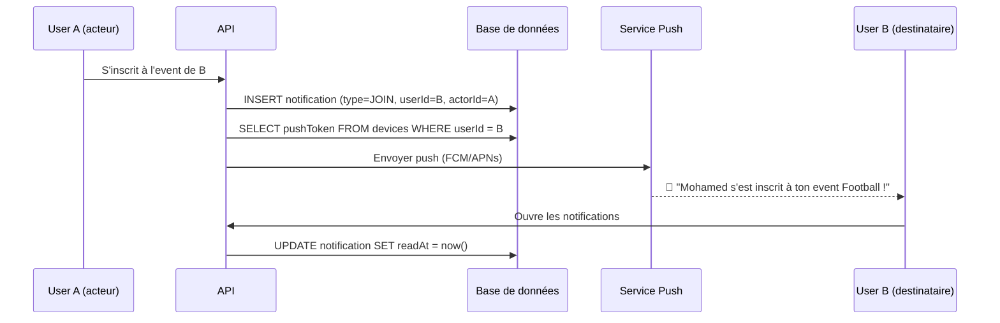

### Device — Appareils enregistrés pour le push

| Champ | Rôle |
|---|---|
| `pushToken` | Token unique FCM (Android) ou APNs (iOS) |
| `platform` | IOS ou ANDROID — détermine quel service push utiliser |
| `revokedAt` | Si non-null, le token est invalidé (l'utilisateur s'est déconnecté de cet appareil) |
| `lastSeenAt` | Dernière activité sur cet appareil — permet de nettoyer les tokens périmés |

> Un user peut avoir **plusieurs devices** (téléphone + tablette). Chaque device reçoit le push.

---

## 10. AuditLog — La traçabilité admin

Journal d'audit polymorphe — enregistre les actions importantes pour le support, la conformité, et le debug.

| Champ | Rôle |
|---|---|
| `actorId` | Qui a fait l'action (null = action système/cron) |
| `entityType` | Type d'entité concernée (`"Event"`, `"User"`, `"Payment"`…) |
| `entityId` | ID de l'entité modifiée |
| `action` | L'action réalisée (`"create"`, `"update"`, `"delete"`, `"cancel"`…) |
| `before` | Snapshot JSON de l'état **avant** la modification |
| `after` | Snapshot JSON de l'état **après** la modification |

### Exemple d'entrée AuditLog

```json
{
  "actorId": "550e8400-...",
  "entityType": "Event",
  "entityId": "6ba7b810-...",
  "action": "update",
  "before": { "status": "draft", "title": "Match foot" },
  "after": { "status": "published", "title": "Match foot Dakar" }
}
```

> **Pas de FK vers User** — volontaire. Si l'acteur est supprimé (soft-delete), les logs survivent. On peut toujours retrouver l'acteur via une requête manuelle sur `actorId`.

---

## 11. Carte des relations complète

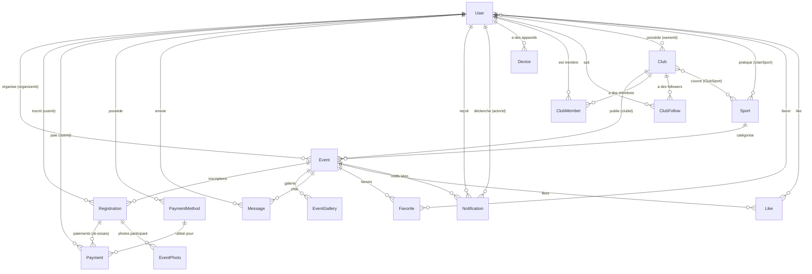

---

## 12. Stratégies de suppression

Chaque relation a une stratégie `onDelete` définie. Voici pourquoi :

| Relation | onDelete | Raison |
|---|---|---|
| Event → User (organizer) | **Restrict** | On ne supprime jamais un event via la suppression de l'organisateur. Le User est soft-deleted de toute façon. |
| Event → Sport | **Restrict** | On ne peut pas supprimer un sport qui a des events associés |
| Event → Club | **SetNull** | Si un club est supprimé, l'event survit mais perd son lien club |
| Club → User (owner) | **SetNull** | Si l'owner est supprimé, le club reste mais sans owner |
| Registration → Event | **Cascade** | Si l'event est supprimé, toutes les inscriptions disparaissent |
| Registration → User | **Cascade** | Si le user est supprimé, ses inscriptions aussi (mais jamais en pratique grâce au soft-delete) |
| Payment → Registration | **Cascade** | Suppression en cascade |
| Payment → PaymentMethod | **SetNull** | Si la méthode de paiement est supprimée, le payment garde l'historique sans le lien |
| Notification → User (actor) | **SetNull** | L'acteur peut disparaître, la notif reste |
| Message → User (sender) | **Cascade** | Ne se déclenche jamais en pratique car User est soft-deleted |
| Toutes les tables de jointure | **Cascade** | UserSport, ClubSport, ClubFollow, Favorite, Like — nettoyage automatique |

---

## 13. Indexation — Pourquoi chaque index existe

### Index GiST (géospatiaux)

| Table | Colonne | Requête optimisée |
|---|---|---|
| `User` | `coords` | "Utilisateurs autour de moi" |
| `Club` | `coords` | "Clubs proches" |
| `Event` | `coords` | "Événements à proximité" — `ST_DWithin(coords, ST_MakePoint(lon, lat), 5000)` |

### Index composites métier

| Table | Index | Requête optimisée |
|---|---|---|
| `Event` | `[status, visibility, startsAt]` | **Feed public** : `WHERE status='published' AND visibility='public' AND starts_at > now() ORDER BY starts_at` |
| `Message` | `[eventId, createdAt]` | **Chat** : pagination chronologique des messages d'un event |
| `Message` | `[eventId, pinned]` | **Messages épinglés** d'un event |
| `Registration` | `[eventId, status]` | **Décompte capacité** : `WHERE event_id = ? AND status <> 'cancelled'` |
| `Registration` | `[eventId, userId]` | **Unicité** : un seul ticket par user par event (contrainte unique) |
| `Notification` | `[userId, readAt]` | **Badge non-lu** : `WHERE user_id = ? AND read_at IS NULL` |
| `Notification` | `[userId, createdAt]` | **Flux chronologique** : notifications récentes d'un user |
| `Payment` | `[provider, providerRef]` | **Idempotence webhook** : contrainte unique |
| `AuditLog` | `[entityType, entityId]` | **Historique d'une entité** : "montre-moi tout ce qui s'est passé sur cet Event" |

### Index simples (FK)

Chaque clé étrangère est indexée pour optimiser les JOINs et les requêtes inverses :

| Table | Index FK | Requête |
|---|---|---|
| `Event` | `[organizerId]`, `[clubId]`, `[sportId]` | "Events de cet organisateur", "Events de ce club" |
| `Registration` | `[userId]`, `[checkedInById]` | "Inscriptions de ce user" |
| `Payment` | `[registrationId]`, `[userId]`, `[paymentMethodId]` | "Paiements de cette inscription" |
| `Notification` | `[actorId]`, `[eventId]` | "Notifs déclenchées par cet acteur" |
| `Device` | `[userId]` | "Appareils de ce user" → envoi push |
| Tables de jointure | `[sportId]`, `[clubId]`, `[eventId]` | Côté "inverse" de la jointure |
