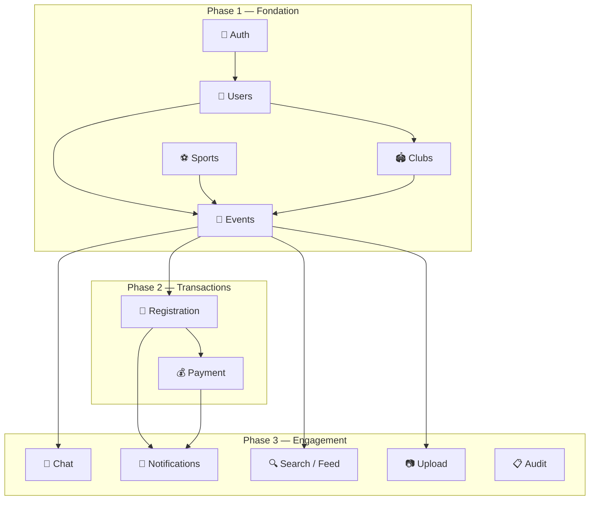
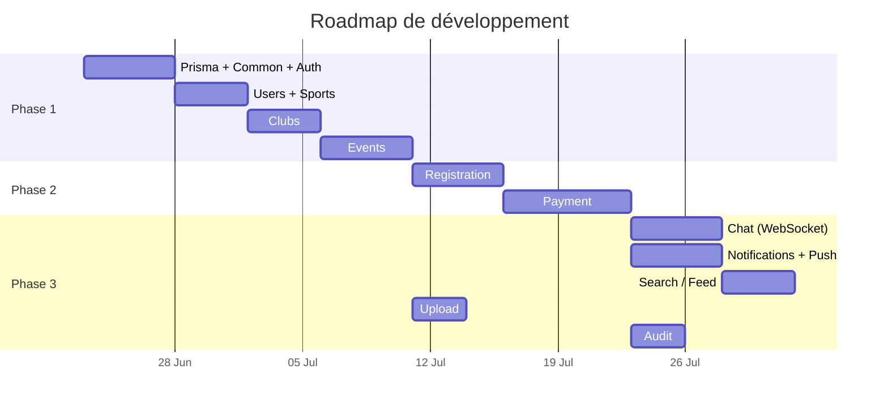

# Jump-In — Modules à Développer

> Découpage de l'application en modules NestJS, dérivé du schéma Prisma.
> Chaque module = un dossier dans `src/` avec son controller, service, DTOs et tests.

---

## Vue d'ensemble



---

## Phase 1 — Fondation

Ces modules sont les briques de base. Rien ne fonctionne sans eux.

---

### Module 1 : `auth`

> Authentification par OTP SMS + gestion des tokens JWT.

#### Endpoints

| Méthode | Route | Description |
|---|---|---|
| `POST` | `/auth/otp/send` | Envoie un code OTP par SMS au numéro fourni |
| `POST` | `/auth/otp/verify` | Vérifie le code OTP et retourne un JWT (access + refresh) |
| `POST` | `/auth/refresh` | Rafraîchit le token d'accès via le refresh token |
| `POST` | `/auth/logout` | Révoque le refresh token |

#### Règles métier

- Si le numéro n'existe pas en base → **créer automatiquement un User** (inscription implicite)
- Rate limiting sur `/otp/send` : max 3 envois par numéro par 5 minutes
- OTP expire après 5 minutes
- Le JWT contient `userId`, `phone`, `username`
- Le refresh token a une durée de vie longue (30 jours)

#### Dépendances externes

- **Provider SMS** : Twilio, Vonage, ou un fournisseur local (Orange SMS API)
- **JWT** : `@nestjs/jwt` + `@nestjs/passport`

#### Fichiers

```
src/auth/
├── auth.module.ts
├── auth.controller.ts
├── auth.service.ts
├── strategies/
│   ├── jwt.strategy.ts
│   └── jwt-refresh.strategy.ts
├── guards/
│   └── jwt-auth.guard.ts
├── dto/
│   ├── send-otp.dto.ts
│   └── verify-otp.dto.ts
└── auth.service.spec.ts
```

---

### Module 2 : `users`

> Gestion du profil utilisateur, préférences et soft-delete.

#### Endpoints

| Méthode | Route | Description |
|---|---|---|
| `GET` | `/users/me` | Profil de l'utilisateur connecté |
| `PATCH` | `/users/me` | Modifier son profil (username, fullName, bio, city, avatar, coords) |
| `PATCH` | `/users/me/settings` | Modifier ses préférences (ecoData, notifEnabled) |
| `GET` | `/users/me/sports` | Lister ses sports |
| `PUT` | `/users/me/sports` | Remplacer la liste de ses sports |
| `GET` | `/users/:id` | Profil public d'un autre utilisateur |
| `DELETE` | `/users/me` | Soft-delete du compte |

#### Règles métier

- `username` unique, validé (alphanumeric + underscore, 3-20 chars)
- `phone` ne peut pas être modifié (c'est l'identifiant de connexion)
- Soft-delete : `deletedAt = now()`, ne supprime jamais physiquement
- Après soft-delete : révoquer tous les tokens, supprimer les devices push
- `coords` mis à jour implicitement via l'en-tête de géolocalisation du client mobile
- Upload avatar → vers le module `upload` (retourne une URL)

#### Fichiers

```
src/users/
├── users.module.ts
├── users.controller.ts
├── users.service.ts
├── dto/
│   ├── update-profile.dto.ts
│   └── update-settings.dto.ts
└── users.service.spec.ts
```

---

### Module 3 : `sports`

> CRUD du catalogue sportif (données de référence, gérées par l'admin).

#### Endpoints

| Méthode | Route | Description |
|---|---|---|
| `GET` | `/sports` | Lister tous les sports (pas de pagination, liste courte) |
| `POST` | `/sports` | Créer un sport *(admin)* |
| `PATCH` | `/sports/:id` | Modifier un sport *(admin)* |
| `DELETE` | `/sports/:id` | Supprimer un sport *(admin, si aucun event lié)* |

#### Règles métier

- `slug` généré automatiquement à partir de `labelFr` (slugify)
- La suppression échoue si des events utilisent ce sport (`onDelete: Restrict`)
- Pas de pagination : le catalogue est petit (10-30 sports)

#### Fichiers

```
src/sports/
├── sports.module.ts
├── sports.controller.ts
├── sports.service.ts
├── dto/
│   └── create-sport.dto.ts
└── sports.service.spec.ts
```

---

### Module 4 : `clubs`

> Gestion des clubs : CRUD, membres, followers.

#### Endpoints

| Méthode | Route | Description |
|---|---|---|
| `POST` | `/clubs` | Créer un club (le créateur devient OWNER) |
| `GET` | `/clubs/:id` | Détail d'un club |
| `PATCH` | `/clubs/:id` | Modifier un club *(OWNER/ADMIN)* |
| `DELETE` | `/clubs/:id` | Supprimer un club *(OWNER)* |
| `GET` | `/clubs/:id/members` | Lister les membres |
| `POST` | `/clubs/:id/members` | Ajouter un membre *(OWNER/ADMIN)* |
| `PATCH` | `/clubs/:id/members/:userId` | Changer le rôle d'un membre *(OWNER)* |
| `DELETE` | `/clubs/:id/members/:userId` | Retirer un membre *(OWNER/ADMIN ou soi-même)* |
| `POST` | `/clubs/:id/follow` | Suivre un club |
| `DELETE` | `/clubs/:id/follow` | Ne plus suivre un club |
| `GET` | `/clubs/:id/sports` | Sports du club |
| `PUT` | `/clubs/:id/sports` | Remplacer les sports du club *(OWNER/ADMIN)* |

#### Règles métier

- **Création** : `INSERT Club` + `INSERT ClubMember (role=OWNER)` dans la même transaction
- `handle` unique, validé (alphanumeric + underscore/dash, 3-30 chars)
- Seul le **OWNER** peut promouvoir un MEMBER en ADMIN, ou rétrograder un ADMIN
- Un OWNER ne peut pas se retirer — il doit transférer le ownership d'abord
- Le `verified` ne peut être changé que par un admin plateforme (pas via l'API club)

#### Fichiers

```
src/clubs/
├── clubs.module.ts
├── clubs.controller.ts
├── clubs.service.ts
├── guards/
│   └── club-role.guard.ts        # Vérifie le rôle dans le club
├── dto/
│   ├── create-club.dto.ts
│   ├── update-club.dto.ts
│   └── add-member.dto.ts
└── clubs.service.spec.ts
```

---

### Module 5 : `events`

> CRUD des événements, galerie, likes, favoris.

#### Endpoints

| Méthode | Route | Description |
|---|---|---|
| `POST` | `/events` | Créer un événement (status=DRAFT) |
| `GET` | `/events/:id` | Détail d'un événement |
| `PATCH` | `/events/:id` | Modifier un événement *(organisateur)* |
| `PATCH` | `/events/:id/publish` | Publier un événement (DRAFT → PUBLISHED) |
| `PATCH` | `/events/:id/cancel` | Annuler un événement |
| `GET` | `/events/:id/gallery` | Lister les photos galerie |
| `POST` | `/events/:id/gallery` | Ajouter une photo galerie *(organisateur)* |
| `DELETE` | `/events/:id/gallery/:photoId` | Supprimer une photo galerie |
| `PATCH` | `/events/:id/gallery/reorder` | Réordonner les photos |
| `POST` | `/events/:id/like` | Liker un événement |
| `DELETE` | `/events/:id/like` | Retirer le like |
| `POST` | `/events/:id/favorite` | Mettre en favori |
| `DELETE` | `/events/:id/favorite` | Retirer des favoris |
| `GET` | `/events/share/:slug` | Résoudre un shareSlug → détail event |

#### Règles métier

- `shareSlug` généré automatiquement (nanoid court, 8-10 chars)
- Seul l'**organisateur** (ou un ADMIN du club lié) peut modifier/publier/annuler
- Un event CANCELLED ne peut plus être re-publié
- Annulation → notifier tous les inscrits (notification type REMINDER ou nouveau type)
- `price = 0` → event gratuit, pas de paiement nécessaire
- `capacity = null` → places illimitées
- Si l'event est lié à un club (`clubId`), l'organisateur doit être ADMIN+ du club

#### Fichiers

```
src/events/
├── events.module.ts
├── events.controller.ts
├── events.service.ts
├── gallery/
│   ├── gallery.controller.ts
│   └── gallery.service.ts
├── interactions/
│   ├── likes.controller.ts
│   ├── favorites.controller.ts
│   └── interactions.service.ts
├── dto/
│   ├── create-event.dto.ts
│   ├── update-event.dto.ts
│   └── reorder-gallery.dto.ts
└── events.service.spec.ts
```

---

## Phase 2 — Transactions

Le cœur business. Implique de l'argent réel → zéro tolérance aux bugs.

---

### Module 6 : `registration`

> Inscription aux événements, gestion des tickets QR, check-in.

#### Endpoints

| Méthode | Route | Description |
|---|---|---|
| `POST` | `/events/:id/register` | S'inscrire à un événement |
| `DELETE` | `/events/:id/register` | Annuler son inscription |
| `GET` | `/events/:id/registrations` | Liste des inscrits *(organisateur)* |
| `GET` | `/users/me/registrations` | Mes inscriptions |
| `GET` | `/registrations/:id/ticket` | Récupérer son QR code / ticket |
| `POST` | `/registrations/check-in` | Scanner un QR pour valider l'entrée *(organisateur)* |
| `POST` | `/registrations/:id/photos` | Ajouter une photo post-event *(participant)* |
| `GET` | `/events/:id/photos` | Photos des participants |

#### Règles métier

- **Vérification de capacité** dans une transaction avec `SELECT ... FOR UPDATE` sur l'event
- Si event gratuit (`price = 0`) → status directement `PAID`
- Si event payant → status `PENDING`, déclencher le module payment
- `ticketCode` généré automatiquement (UUID ou nanoid)
- **Unicité** : `@@unique([eventId, userId])` — un user ne peut s'inscrire qu'une fois
- **Check-in** : scanner le `ticketCode`, vérifier que le status est `PAID`, passer en `CHECKED_IN`
- **Annulation** : possible seulement si `status = PENDING` ou `PAID` (pas après check-in)
- Photos : seuls les inscrits `CHECKED_IN` ou `PAID` peuvent poster

#### Fichiers

```
src/registration/
├── registration.module.ts
├── registration.controller.ts
├── registration.service.ts
├── check-in/
│   ├── check-in.controller.ts
│   └── check-in.service.ts
├── photos/
│   ├── photos.controller.ts
│   └── photos.service.ts
├── dto/
│   ├── register.dto.ts
│   └── check-in.dto.ts
└── registration.service.spec.ts
```

---

### Module 7 : `payment`

> Paiements mobile money (Wave, Orange Money, Free Money) et carte.

#### Endpoints

| Méthode | Route | Description |
|---|---|---|
| `POST` | `/payments/initiate` | Initier un paiement pour une inscription |
| `POST` | `/payments/webhook/:provider` | Recevoir le callback du PSP *(public, vérifié par signature)* |
| `GET` | `/users/me/payments` | Historique de mes paiements |
| `GET` | `/users/me/payment-methods` | Mes moyens de paiement enregistrés |
| `POST` | `/users/me/payment-methods` | Ajouter un moyen de paiement |
| `PATCH` | `/users/me/payment-methods/:id/default` | Définir comme moyen par défaut |
| `DELETE` | `/users/me/payment-methods/:id` | Supprimer un moyen de paiement |

#### Règles métier

- **Initiation** : créer un `Payment` en `PENDING`, appeler l'API du PSP
- **Webhook** : vérifier la signature du PSP, mettre à jour le Payment en `SUCCESS` ou `FAILED`
- **Idempotence** : `@@unique([provider, providerRef])` → si le webhook arrive 2 fois, le deuxième est ignoré
- Si Payment `SUCCESS` → mettre la Registration en `PAID` + envoyer notification `PAYMENT`
- Si Payment `FAILED` → l'utilisateur peut ré-essayer (nouveau Payment créé)
- **Un seul Payment SUCCESS par Registration** (garanti par index unique SQL)
- **Méthode par défaut** : un seul `isDefault = true` par user (index unique partiel SQL)
- `fee` = commission plateforme, calculée côté serveur (ex: 3% du montant)
- Ne **jamais** stocker les données de carte en clair — déléguer au PSP

#### Dépendances externes

- **Wave API** : SDK ou API REST Wave
- **Orange Money API** : API OM
- **Stripe / PayDunya** : pour les paiements par carte

#### Fichiers

```
src/payment/
├── payment.module.ts
├── payment.controller.ts
├── payment.service.ts
├── webhook/
│   ├── webhook.controller.ts
│   └── webhook.service.ts
├── payment-methods/
│   ├── payment-methods.controller.ts
│   └── payment-methods.service.ts
├── providers/
│   ├── wave.provider.ts
│   ├── orange-money.provider.ts
│   ├── free-money.provider.ts
│   └── card.provider.ts
├── dto/
│   ├── initiate-payment.dto.ts
│   └── create-payment-method.dto.ts
└── payment.service.spec.ts
```

---

## Phase 3 — Engagement

Ces modules rendent l'app vivante et addictive.

---

### Module 8 : `chat`

> Messagerie en temps réel par événement (WebSocket).

#### Endpoints REST

| Méthode | Route | Description |
|---|---|---|
| `GET` | `/events/:id/messages` | Historique des messages (paginé, cursor-based) |
| `GET` | `/events/:id/messages/pinned` | Messages épinglés |
| `PATCH` | `/messages/:id/pin` | Épingler/désépingler *(organisateur)* |
| `DELETE` | `/messages/:id` | Supprimer un message *(auteur ou organisateur)* |

#### WebSocket Gateway

| Événement | Direction | Description |
|---|---|---|
| `message:send` | Client → Serveur | Envoyer un message (TEXT, LOCATION) |
| `message:new` | Serveur → Client | Nouveau message reçu |
| `message:typing` | Bidirectionnel | Indicateur de frappe |
| `message:pinned` | Serveur → Client | Un message a été épinglé |

#### Règles métier

- Seuls les **inscrits** (Registration PAID ou CHECKED_IN) peuvent envoyer des messages
- Les messages `SYSTEM` sont créés automatiquement par le serveur (jamais par un client)
- Le `metadata` pour les messages `LOCATION` contient `{ lat, lng, label? }`
- Pagination cursor-based sur `createdAt` (pas offset — le chat peut avoir beaucoup de messages)
- Le message d'un user soft-deleted reste visible mais avec un sender anonymisé

#### Dépendances

- `@nestjs/websockets` + `@nestjs/platform-socket.io` (ou `ws`)

#### Fichiers

```
src/chat/
├── chat.module.ts
├── chat.controller.ts         # REST endpoints
├── chat.gateway.ts            # WebSocket gateway
├── chat.service.ts
├── dto/
│   └── send-message.dto.ts
└── chat.service.spec.ts
```

---

### Module 9 : `notifications`

> Notifications in-app + push (FCM/APNs).

#### Endpoints

| Méthode | Route | Description |
|---|---|---|
| `GET` | `/users/me/notifications` | Mes notifications (paginées) |
| `GET` | `/users/me/notifications/unread-count` | Nombre de notifications non lues |
| `PATCH` | `/notifications/:id/read` | Marquer comme lue |
| `PATCH` | `/notifications/read-all` | Tout marquer comme lu |
| `POST` | `/users/me/devices` | Enregistrer un device push |
| `DELETE` | `/users/me/devices/:id` | Supprimer / révoquer un device |

#### Règles métier

- **Création** : les notifications sont créées par les autres modules (jamais directement par un endpoint)
- **Push** : quand une notification est créée, chercher les `Device` actifs (`revokedAt IS NULL`) du destinataire et envoyer le push
- **Respect du `notifEnabled`** : si le user a désactivé les notifs, ne pas envoyer de push (mais la notif in-app est quand même créée)
- **Batch** : si un event reçoit 50 inscriptions en 1 minute, regrouper les notifs JOIN
- **Nettoyage devices** : un token FCM/APNs peut expirer — gérer les erreurs push et révoquer les tokens invalides
- `readAt` : null = non lue, date = lue

#### Déclencheurs par type

| Type | Déclenché par | Destinataire |
|---|---|---|
| `JOIN` | Nouvelle inscription | L'organisateur de l'event |
| `REMINDER` | Cron job (1h avant l'event) | Tous les inscrits |
| `SPOT` | Annulation d'une inscription | Les users en attente (si implémenté) |
| `MESSAGE` | Nouveau message chat | Les inscrits de l'event |
| `PAYMENT` | Payment SUCCESS ou FAILED | L'utilisateur qui a payé |
| `INVITE` | Invitation club | L'utilisateur invité |

#### Dépendances externes

- **Firebase Admin SDK** : pour FCM (Android)
- **APNs** : pour iOS (via Firebase ou directement)

#### Fichiers

```
src/notifications/
├── notifications.module.ts
├── notifications.controller.ts
├── notifications.service.ts      # CRUD notifications
├── push/
│   ├── push.service.ts           # Envoi push FCM/APNs
│   └── push.service.spec.ts
├── devices/
│   ├── devices.controller.ts
│   └── devices.service.ts
├── dto/
│   └── register-device.dto.ts
└── notifications.service.spec.ts
```

---

### Module 10 : `search`

> Feed public, recherche géographique, filtres.

#### Endpoints

| Méthode | Route | Description |
|---|---|---|
| `GET` | `/feed` | Feed public (events PUBLISHED + PUBLIC, triés par date) |
| `GET` | `/feed/nearby` | Events à proximité (géolocalisation) |
| `GET` | `/feed/for-you` | Events personnalisés (basés sur les sports du user) |
| `GET` | `/search/events` | Recherche d'events par texte |
| `GET` | `/search/clubs` | Recherche de clubs par texte |
| `GET` | `/search/users` | Recherche d'utilisateurs |

#### Règles métier

- **Feed public** : `WHERE status = 'published' AND visibility = 'public' AND starts_at > now() ORDER BY starts_at`
- **Nearby** : `ST_DWithin(coords, user_coords, radius_meters)` — rayon configurable (défaut 10km)
- **For you** : filtrer par les `sportId` du user (via UserSport)
- **Pagination** : cursor-based sur `startsAt` pour le feed, offset pour la recherche texte
- **ecoData** : si le user a activé le mode éco, retourner les URLs d'images en basse résolution

#### Fichiers

```
src/search/
├── search.module.ts
├── feed.controller.ts
├── search.controller.ts
├── feed.service.ts
├── search.service.ts
└── search.service.spec.ts
```

---

### Module 11 : `upload`

> Upload et gestion des fichiers (images).

#### Endpoints

| Méthode | Route | Description |
|---|---|---|
| `POST` | `/upload/image` | Upload une image, retourne l'URL |
| `DELETE` | `/upload/:key` | Supprimer une image |

#### Règles métier

- Upload vers un **bucket S3** (ou Cloudflare R2, Supabase Storage)
- Génération de **2 variantes** : original + thumbnail (pour le mode ecoData)
- Validation : formats acceptés (JPEG, PNG, WebP), taille max 10MB
- Nommage : `{type}/{userId}/{uuid}.{ext}` (ex: `avatars/550e8400.../abc123.jpg`)
- Retourne l'URL CDN publique

#### Dépendances externes

- **AWS S3** / **Cloudflare R2** / **Supabase Storage**
- **Sharp** : pour le resize des images

#### Fichiers

```
src/upload/
├── upload.module.ts
├── upload.controller.ts
├── upload.service.ts
└── upload.service.spec.ts
```

---

### Module 12 : `audit`

> Journal d'audit automatique pour la traçabilité admin.

#### Fonctionnement

Ce module est **passif** — il n'expose pas d'endpoints publics. Il écoute les événements métier via un système d'events NestJS (`EventEmitter2`) et enregistre les entrées dans `AuditLog`.

#### Actions loguées

| Action | entityType | Déclencheur |
|---|---|---|
| `create` | Event | Création d'un event |
| `update` | Event | Modification d'un event |
| `publish` | Event | Publication |
| `cancel` | Event | Annulation |
| `register` | Registration | Nouvelle inscription |
| `check_in` | Registration | Check-in |
| `payment_success` | Payment | Paiement confirmé |
| `payment_failed` | Payment | Paiement échoué |
| `soft_delete` | User | Suppression de compte |
| `role_change` | ClubMember | Changement de rôle dans un club |

#### Fichiers

```
src/audit/
├── audit.module.ts
├── audit.service.ts
├── audit.listener.ts    # @OnEvent handlers
└── audit.service.spec.ts
```

---

## Module transverse : `common`

> Utilitaires partagés par tous les modules.

```
src/common/
├── decorators/
│   ├── current-user.decorator.ts    # @CurrentUser() dans les controllers
│   └── public.decorator.ts          # @Public() pour les routes sans auth
├── filters/
│   └── prisma-exception.filter.ts   # Traduit les erreurs Prisma en HTTP
├── interceptors/
│   └── transform.interceptor.ts     # Enveloppe les réponses { data, meta }
├── pipes/
│   └── uuid-validation.pipe.ts      # Valide les params UUID
├── guards/
│   └── roles.guard.ts               # Guard générique de rôles
└── dto/
    └── pagination.dto.ts            # Cursor-based pagination partagée
```

---

## Ordre de développement recommandé



| Phase | Modules | Durée estimée | Pourquoi cet ordre |
|---|---|---|---|
| **1** | Auth → Users → Sports → Clubs → Events | ~3 semaines | Impossible de créer des events sans users, sports et auth |
| **2** | Registration → Payment | ~2 semaines | Le cœur business — dépend de Events |
| **3** | Chat, Notifications, Search, Upload, Audit | ~3 semaines | Engagement et polish — développables en parallèle |

---

## Résumé par module

| # | Module | Endpoints | WebSocket | Priorité | Complexité |
|---|---|---|---|---|---|
| 1 | `auth` | 4 | ❌ | 🔴 Critique | Moyenne |
| 2 | `users` | 7 | ❌ | 🔴 Critique | Faible |
| 3 | `sports` | 4 | ❌ | 🔴 Critique | Faible |
| 4 | `clubs` | 12 | ❌ | 🟠 Haute | Moyenne |
| 5 | `events` | 14 | ❌ | 🔴 Critique | Haute |
| 6 | `registration` | 8 | ❌ | 🔴 Critique | Haute |
| 7 | `payment` | 7 | ❌ | 🔴 Critique | **Très haute** |
| 8 | `chat` | 4 | ✅ | 🟠 Haute | Haute |
| 9 | `notifications` | 6 | ❌ | 🟠 Haute | Moyenne |
| 10 | `search` | 6 | ❌ | 🟡 Moyenne | Moyenne |
| 11 | `upload` | 2 | ❌ | 🟡 Moyenne | Faible |
| 12 | `audit` | 0 (passif) | ❌ | 🟢 Basse | Faible |
| — | `common` | 0 (utilitaires) | ❌ | 🔴 Critique | Faible |
